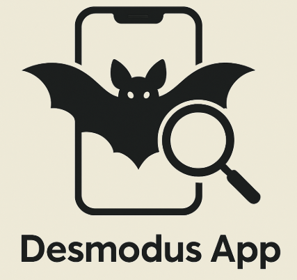

# Desmodus App: Detector del murciélago vampiro

    

    
    
    
    
    
    
    

---

# Tabla de contenidos (wip)

1. [Descripción](#1-descripción)
2. [Demostración visual](#2-demostración-visual)
3. [Stack tecnológico](#3-stack-tecnológico)
4. [Requisitos técnicos](#4-requisitos-técnicos)
5. [Instalación y configuración](#5-instalación-y-configuración)
6. [Estructura de archivos del proyecto](#6-estructura-de-archivos-del-proyecto)
7. [Instrucciones de ejecución](#7-instrucciones-de-ejecución)
8. [Explicación técnica del funcionamiento](#8-explicación-técnica-del-funcionamiento)
9. [Buenas prácticas y errores comunes](#9-buenas-prácticas-y-errores-comunes)
10. [Limitaciones del proyecto](#10-limitaciones-del-proyecto)
11. [Recomendaciones futuras](#11-recomendaciones-futuras)
12. [Autores y contacto](#12-autores-y-contacto)
